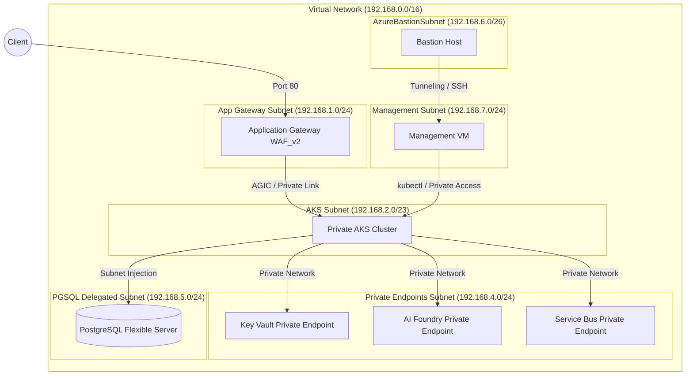

# OpsGPT Infrastructure Deployment with Terraform
#
This directory contains the highly modular, secure, and production-grade Infrastructure-as-Code (IaC) configuration for deploying the **OpsGPT** environment on Microsoft Azure using Terraform.

---

## Architecture Overview

All resources are provisioned inside the pre-existing `Aasik-OpsGPT` resource group in the **West Europe** (`westeurope`) region to leverage available vCPU and VM capacity. The network topology is completely private, ensuring that no database, key vault, or container metrics are exposed to the public internet.
#


---

## Directory Structure

In compliance with corporate modular layout standards, the codebase is structured as follows:

```text
terraform/
├── .gitignore             # Git exclusion rules for secrets and state files
├── bootstrap.ps1          # Automation script to pre-create Storage Account and init backend
├── backend.tf             # Dynamically generated remote state config (uses azurerm backend)
├── main.tf                # Root module instantiating sub-modules and data sources
├── variables.tf           # Root variable declarations (types, defaults, sensitive)
├── outputs.tf             # Root outputs exposing cluster endpoints and details
├── terraform.tfvars       # Environment configuration values
└── modules/
    ├── vnet/              # Module: Virtual Network, Subnets, Bastion Host, AppGW, Mgmt VM
    ├── aks/               # Module: Private AKS, AGIC role assignments, Prometheus DCR/DCE
    ├── database/          # Module: Private PostgreSQL Flexible Server & Private DNS
    └── storage/           # Module: Key Vault, AI OpenAI Foundry, Service Bus, App Insights, Slack Action Group
```

---

## Component Details

### 1. Networking (`modules/vnet`)
- **Virtual Network**: IP Address space `192.168.0.0/16`.
- **Subnet Segmentation**:
  - `appgw-subnet` (`192.168.1.0/24`) for load balancing entrypoint.
  - `aks-subnet` (`192.168.2.0/23`) for Kubernetes nodes and CNI pod allocation.
  - `pe-subnet` (`192.168.4.0/24`) for hosting Private Endpoints (Vault, OpenAI, Service Bus).
  - `pgsql-subnet` (`192.168.5.0/24`) delegated exclusively to flexible database engines.
  - `AzureBastionSubnet` (`192.168.6.0/26`) for secure bastion tunnels.
  - `mgmt-subnet` (`192.168.7.0/24`) for hosting a secure, private Linux VM to run cluster admin operations.
- **Application Gateway**: Configured with WAF_v2, custom Web Application Firewall policies in `Prevention` mode (OWASP 3.2 ruleset enabled), and an HTTP listener on port 80.
- **Bastion Host & VM**: Integrates Azure Bastion to allow tunnel-based administrative SSH access to the Management VM (`Standard_D2s_v3`) without exposing any public ports.

### 2. Kubernetes Cluster (`modules/aks`)
- **Private Access**: Node and API server communication occurs privately inside the VNet.
- **Azure CNI Overlay**: Efficiently handles Pod IPs using overlay networking (`10.244.0.0/16` range) with network policy set to `none`.
- **Key Vault CSI Driver**: CSI Secrets Store provider enabled to mount secrets directly into Pods as files.
- **Autoscaling**: Scalability enabled dynamically (Min: 1 node, Max: 3 nodes).
- **Monitoring**: Integrated with Log Analytics and Azure Monitor Workspace for Managed Prometheus and Grafana.
- **AGIC**: Application Gateway Ingress Controller enabled natively; automatically assigns IAM roles (Contributor on AppGW, Network Contributor on Subnet) to the cluster's ingress managed identity.

### 3. Database Engine (`modules/database`)
- **Engine**: Azure Database for PostgreSQL Flexible Server (`opsgpt-db-server-aasik-we`).
- **Geo-Redundancy**: High-availability geo-redundant backups enabled (requires General Purpose VM tier).
- **Private DNS**: Private DNS zone `opsgpt-pgsql-dns.postgres.database.azure.com` integrated to resolve connection URIs privately inside the VNet.
- **Lifecycle Protection**: Added zone update locks (`ignore_changes`) to avoid conflicts with Azure availability zone placement.

### 4. Storage & Monitoring (`modules/storage`)
- **Azure Key Vault**: Private Key Vault with public network access completely disabled (`Deny` default action). Uses Private Endpoint for backend access.
- **AI OpenAI Foundry**: Cognitive Services account of kind `OpenAI` supporting standard real-time model deployment for `gpt-4o-mini` (version `2024-07-18`, GlobalStandard SKU) with public network access blocked. Uses Private Endpoint.
- **Service Bus**: Messaging broker namespace (Premium tier required for VNet/Private Endpoint support) and queue for infrastructure alerts. Configured with a single premium partition.
- **Slack Alerts**: Azure Monitor Action Group configured with a secure webhook receiver to forward critical alerts to your Slack workspace.
- **Telemetry**: Log Analytics Workspace and Application Insights deployed to gather live application traces.

---

## Remote State with Locking

To solve the multi-developer concurrency problem (state conflicts/corruptions), we use **Azure Storage Account Remote State** with **Blob Lease Locking**.

Instead of writing this infrastructure state locally, the state is locked and saved in a central storage account container:
- **Storage Account**: `opsgpttfstateaasik` (Standard_LRS, HTTPS only, TLS 1.2 enforced).
- **Container**: `tfstate`
- **Leasing**: Azure Blob Storage automatically enforces write locks during `terraform apply` to prevent simultaneous updates.

We use `bootstrap.ps1` to automatically verify the subscription context, pre-create the backend storage container, write the `backend.tf` configuration, and run `terraform init`.

---

## Deployment Instructions

### Prerequisites
1. Install Azure CLI and authenticate:
   ```powershell
   az login
   az account set --subscription "65bf2554-8090-4538-9c38-8a6e9c5f6f22"
   ```

### Step 1: Bootstrapping the Backend
Execute the PowerShell script inside the `terraform` folder to initialize the remote backend:
```powershell
.\bootstrap.ps1
```

### Step 2: Configure Secrets
Create a `secrets.tfvars` file or update your parameters with the sensitive passwords:
```hcl
db_admin_password = "YourSecurePasswordHere!"
vm_admin_password = "YourSecureVMIPasswordHere!"
slack_webhook_url = "https://hooks.slack.com/services/T.../B.../..."
```

### Step 3: Validate and Plan
Perform code validation and a dry-run execution plan:
```powershell
terraform validate
terraform plan -var-file="terraform.tfvars" -var-file="secrets.tfvars"
```

### Step 4: Provision
Apply the configurations to deploy the architecture to Azure:
```powershell
terraform apply -var-file="terraform.tfvars" -var-file="secrets.tfvars"
```
*(Enter `yes` when prompted)*

### Step 5: Post-Deployment Namespaces Creation
Because the AKS cluster is fully private, the API server endpoint is not accessible from your local machine.
1. Connect to the Management Jumpbox VM (`opsgpt-mgmt-vm`) via Azure Bastion through the Azure portal.
2. Authenticate the Jumpbox with Azure CLI and download the cluster credentials:
   ```bash
   az aks get-credentials --resource-group Aasik-OpsGPT --name opsgpt-aks-aasik
   ```
3. Run the namespace creation commands:
   ```bash
   kubectl create namespace dev
   kubectl create namespace prod
   ```
